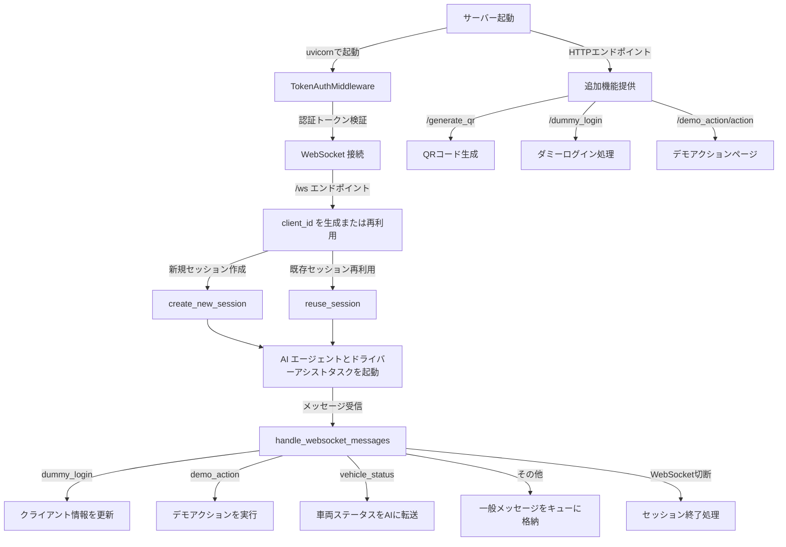

# `realtime_app.py` の概要

このドキュメントでは、`realtime_app.py` 内の各関数の役割について説明します。

## 概要




## 関数一覧

### 1. `create_new_session`
- **役割**: 新しいクライアントセッションを作成します。
- **詳細**:
  - クライアントごとに WebSocket、キュー、AI エージェントを初期化。
  - ドライバーアシストタスクと AI エージェントタスクをバックグラウンドで起動。
  - クライアント ID をクライアントに送信。

---

### 2. `reuse_session`
- **役割**: 既存のクライアントセッションを再利用します。
- **詳細**:
  - 既存のセッションに新しい WebSocket を再割り当て。
  - 必要に応じてクライアント ID を再送信。

---

### 3. `handle_websocket_messages`
- **役割**: WebSocket を通じてクライアントからのメッセージを処理します。
- **詳細**:
  - メッセージタイプに応じて処理を分岐（例: `dummy_login`, `demo_action`, `vehicle_status` など）。
  - 必要に応じて AI エージェントや他のクライアントにメッセージを転送。
  - WebSocket の切断時にセッションをクリーンアップ。

---

### 4. `websocket_endpoint`
- **役割**: WebSocket 接続のエントリーポイント。
- **詳細**:
  - クライアント ID を生成または再利用。
  - 新しいセッションを作成するか、既存セッションを再利用。
  - メッセージ処理ループを開始。

---

### 5. `generate_qr_code_with_clients`
- **役割**: QR コードを生成します。
- **詳細**:
  - クライアント ID を検証し、QR コードを生成。

---

### 6. `homepage`
- **役割**: ホームページを提供します。
- **詳細**:
  - `static/index.html` を返却。
  - ファイルが見つからない場合はエラーメッセージを表示。

---

### 7. `dummy_login_with_clients`
- **役割**: ダミーログインを処理します。
- **詳細**:
  - クライアント ID を検証し、ログインページを表示。

---

### 8. `health_check`
- **役割**: サーバーのヘルスチェックを行います。
- **詳細**:
  - サーバーの状態を JSON 形式で返却。

---

### 9. `voice_input_toggle_client`
- **役割**: クライアントの音声入力を切り替えます。
- **詳細**:
  - クライアント ID を検証し、音声入力の有効/無効を切り替えるメッセージを送信。

---

## ミドルウェア

### `TokenAuthMiddleware`
- **役割**: トークンベースの認証を行います。
- **詳細**:
  - HTTP および WebSocket リクエストで認証トークンを検証。
  - トークンが無効な場合、リクエストを拒否。

---

## 補助関数

### `get_vehicle_data_by_scenario`
- **役割**: シナリオに基づいて車両データを取得します。
- **詳細**:
  - 指定されたアクションに一致する車両データを検索。
  - 一致しない場合はエラーログを出力。

---

このドキュメントは、`realtime_app.py` の理解を深めるための参考資料としてご利用ください。
```